# Bitcoin Block Arrival Time Dataset

A dataset of block arrival times at different nodes.

## CSV Format

The `timestamps.csv` file contains the block `height`, `hash`, the millisecond
`timestamp` it arrived (not the timestamp in the header), and the name of the
`source`. It does **not** contain a CSV header.

Example:
```
height hash                                                             timestamp     source
759483,00000000000000000002b74f1fd927768b2bfd52d2a5229826303d480db5c76a,1666250167839,0xB10C monitoring1
759483,00000000000000000002b74f1fd927768b2bfd52d2a5229826303d480db5c76a,1666250167000,0xb10c memo
759482,00000000000000000006e1c51365637bbc9a977b6bc027c00613025c1625a00a,1666249466074,0xB10C monitoring1
```

## Adding Data

To add your block arrival times, create a CSV file with the above format.
Make sure the timestamps are in millisecond precision, and you've added a name
for the source. You can use `cat timestamps.csv your-timestamps.csv > new-timestamps.csv`
to create a new, unsorted timestamp file. To sort it, you can use
`LC_ALL=C sort --reverse --check --unique new-timestamps.csv > timestamps.csv`.


Also, please remember to update the data-availability graph (see below).

## Quality Assurance

The dataset is run through automatic quality assurance checks in the CI. A
sanity check tests if the dataset is sorted and doesn't contain duplicate
rows. Additionally, there is a check for the arrival timestamps. We assume
these should be either two hours before or after the block header timestamp.
For this, we maintain a list of height and header timestamps in
"qa/block-timestamps/block-timestamps.csv". When adding new timestamps, the
list might need to be updated. This can be done with the Bash script
"qa/block-timestamps/update-block-timestamps.sh" requiring a Bitcoin Core
instance with the REST server enabled.

A data availability graph can be generated with the tool 
`qa/data-availability/gen-mermaid.py`. This should be updated when adding a
new data source.

```mermaid
gantt
dateFormat x
title data availability (not showing potential per-source holes)
todayMarker off

0xb10c memo: 1635945250000, 1666268995000
0xB10C monitoring1: 1605513978094, 1666260553663
0xb10c memo-old: 1562848974000, 1585739362000

```


