# Bitcoin Block Arrival Time Dataset

A dataset of block arrival times as seen by multiple nodes on the Bitcoin Network.

## Dataset

The dataset is split over multiple CSV files in the `data` directory. One CSV
file per source. Each file contains the block `height`, the header `hash`, the
millisecond `timestamp` the block arrived/was first connected at the node. The
CVS files do not have a header.

Example:
```
759483,00000000000000000002b74f1fd927768b2bfd52d2a5229826303d480db5c76a,1666250167839
759483,00000000000000000002b74f1fd927768b2bfd52d2a5229826303d480db5c76a,1666250167000
759482,00000000000000000006e1c51365637bbc9a977b6bc027c00613025c1625a00a,1666249466074
```

The sources can be combined into one, multi-source CSV file with the Python
script `contrib/combine.py`.

## Adding Data

To add your block arrival times, create a CSV file with the above format in
the data directory. Make sure the timestamps are in millisecond precision.
Also, remember to update the data-availability graph (see below).

Block arrival timestamps can be parsed from the Bitcoin Core `debug.log`.
A Python tool is provided under `contrib/process-debug-log.py`. This expects
a `debug.log` as input file, and a CSV file output name.

```
python3 contrib/process-debug-log.py /home/b10c/.bitcoin/debug.log data/my-timestamps.csv
```

## Quality Assurance

The dataset is run through automatic quality assurance checks in the CI.
There is a check for the arrival timestamps. We assume these should be
either two hours before or after the block header timestamp. For this, we
maintain a list of height and header timestamps in
`qa/block-timestamps/block-timestamps.csv`. When adding new timestamps, the
list might need to be updated. This can be done with the Bash script
`qa/block-timestamps/update-block-timestamps.sh` requiring a Bitcoin Core
instance with the REST server enabled.

The following availability graph can be generated with the tool
`qa/data-availability/gen-mermaid.py`. This should be updated when adding a
new data source.

```mermaid
gantt
dateFormat x
title data availability (not showing potential per-source holes)
todayMarker off

0xb10c_peer-observer-frank: 1707523605000, 1764633510232
0xb10c_peer-observer-charlie: 1707523605000, 1764633502435
0xb10c_peer-observer-erin: 1707523606000, 1764633502410
0xb10c_peer-observer-bob: 1707523605000, 1764633502292
0xb10c_peer-observer-dave: 1707523606000, 1764633502266
0xb10c_peer-observer-alice: 1707523605000, 1764633502241
0xb10c_rs2: 1656356008000, 1727433209000
vostrnad_node1: 1678416045000, 1702535282000
n-thumann: 1669583939000, 1702072477000
darosior_node0: 1676970378000, 1702022714000
0xb10c_monitoring1: 1605513978094, 1701968604513
KIT_monitorB: 1554813325167, 1701803016066
KIT_monitor2: 1439645276225, 1701798709781
KIT_monitor1: 1439476817617, 1701797554640
0xb10c_memo: 1635945250000, 1666268995000
offing-gcp: 1633117022000, 1639414560000
0xb10c_memo-old: 1562848974000, 1605772694000

```


